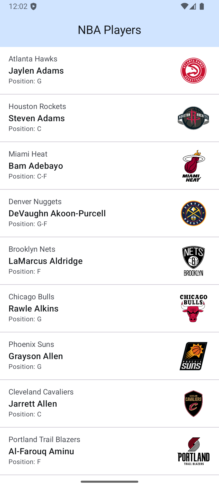
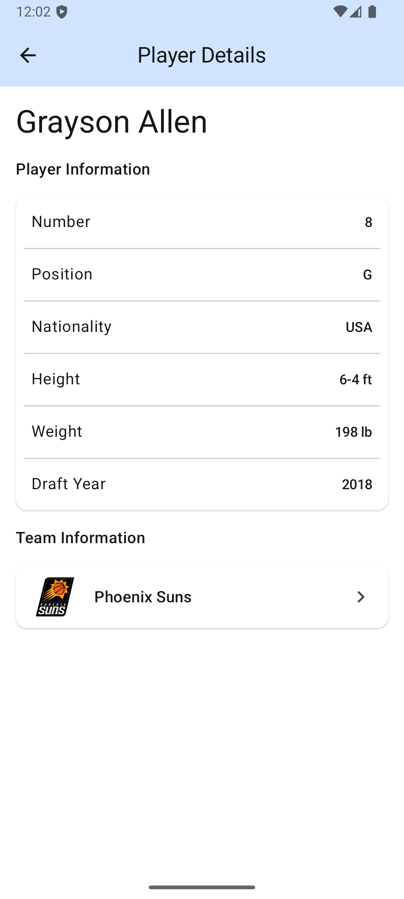
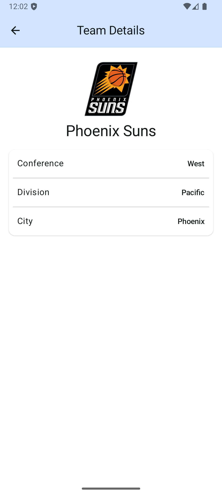

# Getting Started

This project integrates with the [Ball Don't Lie API](https://www.balldontlie.io) to fetch basketball-related data. Follow the steps below to set up the project:

## Prerequisites

1. Install **Android Studio** (latest version recommended).
2. Ensure you have configured the required Android SDKs and tools.

## Configuration

1. Visit the [Ball Don't Lie API documentation](https://www.balldontlie.io) for details about the API.
2. Open the `local.properties` file located at the root of the project.
3. Add your API key to the file by including the following line:

   ```properties
   API_KEY="your_api_key"

4. Replace your_api_key with the actual API key from [www.balldontlie.io](https://www.balldontlie.io).

## Screenshots

 

